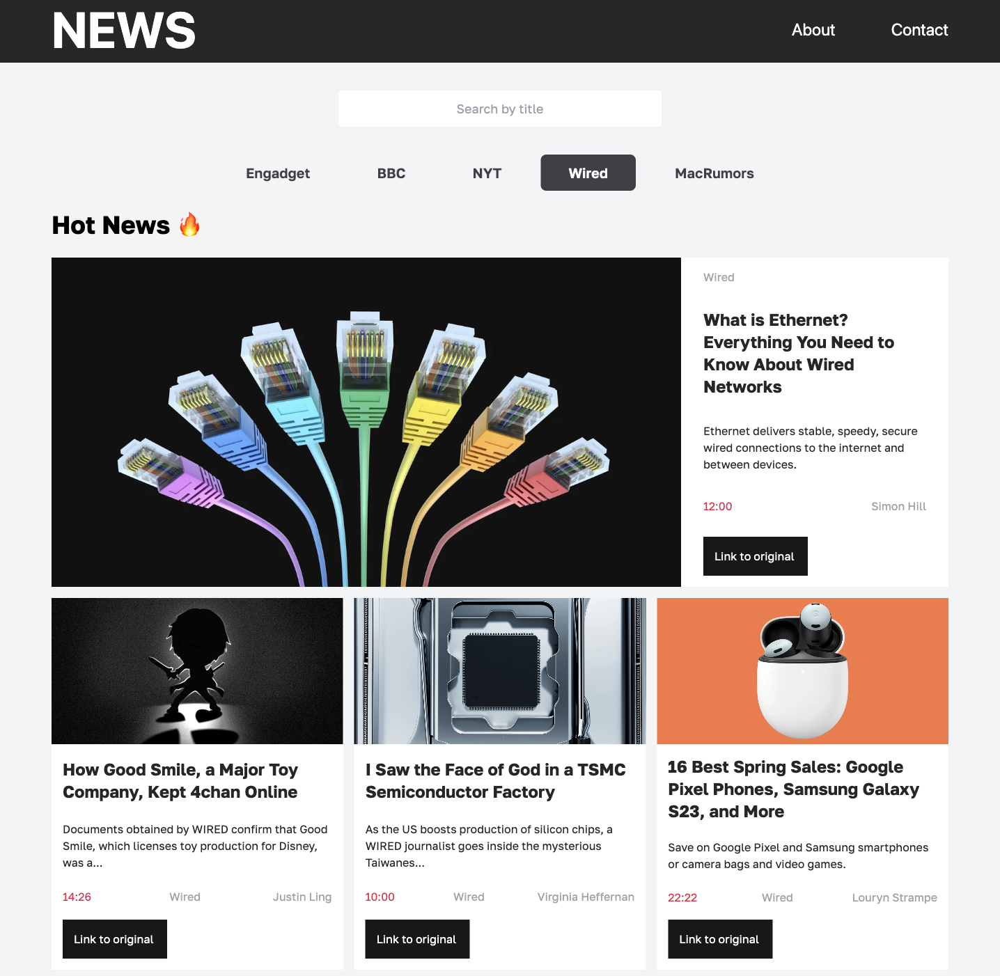

 

  <a href="https://fresh-news-website.netlify.app/#/news-website" target='_blank'>
    

<h3 align="center">News website</h3>

  

    A site I created using the open NewsAPI, React and Tailwind
     
    <a href="https://github.com/LychakVlad/news-website"><strong>Explore the code »</strong></a>
     
     
    <a href="https://fresh-news-website.netlify.app/#/news-website">View Demo</a>
  

<!-- ABOUT THE PROJECT -->

## About The Project

The News Website is a web application that provides users with the latest news and information on various topics. This project is developed using technologies such as Tailwind and React with tiny server built with Node JS. The application is responsive, which means it can be accessed from any device.

This project includes filtering and search functionality to help users quickly find the news they are looking for. Users can filter news wares based on their source site such as Engadget, BBC, NYT, and Lifehacker. Additionally, the search bar allows users to search for specific news wares based on keywords.

### Built With

- REACT JS
- TAILWIND
- Node JS
- Express JS

## Contact

Vladislav Lychak - [@LinkedIn](https://www.linkedin.com/in/vladislav-lychak/) - lycakvladislav@gmail.com

Project Link: [https://fresh-news-website.netlify.app/#/news-website](https://fresh-news-website.netlify.app/#/news-website)

(<a href="#readme-top">back to top</a>)

<!-- MARKDOWN LINKS & IMAGES -->
<!-- https://www.markdownguide.org/basic-syntax/#reference-style-links -->

[react.js]: https://img.shields.io/badge/React-20232A?style=for-the-badge&logo=react&logoColor=61DAFB
[react-url]: https://reactjs.org/
